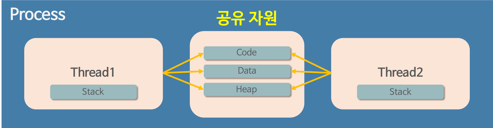

# 안드로이드 스터디 2주차

# 스레드(Thread)란?

운영체제에서 스레드는 프로세스 내부에서 실행되는 작은 작업 단위이다.

모든 프로세스에는 한 개 이상의 스레드가 존재하여 작업을 수행한다.

또한, 두 개 이상의 스레드를 가지는 프로세스를 멀티스레드 프로세스라고 한다.

> **프로세스(Process)란?**
> 프로세스란 단순히 실행 중인 프로그램이다.
> 즉, 사용자가 작성한 프로그램이 운영체제에 의해 메모리 공간을 할당받아 실행 중인 것을 말한다. 이러한 프로세스는 프로그램에 사용되는 데이터와 메모리 등의 자원 그리고 스레드로 구성된다.

**스레드와의 차이점으로는 독립성에 있다. 프로세스는 다른 프로세스에 영향을 미치지 않지만 스레드는 다른 스레드에 영향을 미칠 수 있다.**

(비유 : 밥 먹기, 공부하기, 운동하기에서 밥을 못먹었다고 공부나 운동을 못하지 않고 공부를 안했다고 밥이나 운동을 못하지 않는다. 각각 서로 다른 일인 것 ⇒ 프로세스

밥먹기(밥 짓기, 반찬 만들기, 수저 준비, 식사, 뒷정리)에서 밥 짓기를 하지 못하면 식사를 할 수 없는 것과 같은 작업 ⇒ 스레드

밥 짓기, 반찬 만들기, 식사 등등의 여러 작업을 동시에 처리하는 것 ⇒ 멀티스레드

> 멀티스레드(Mutli-Thread)란?
> 하나의 응용프로그램을 여러 개의 스레드로 구성하고 각 스레드로 하여금 하나의 작업을 처리하도록 한다. 윈도우, 리눅스 등 많은 운영체제들이 멀티 프로세싱을 지원하고 있지만 멀티 스레딩을 기본으로 한다. 웹서버는 대표적인 멀티스레드 응용 프로그램이다.
> 장점 :

1. 높은 성능
2. 높은 자원 활용도
3. 높은 응답성
   단점 :
4. 동기화 문제
5. 교착상태
6. 디버깅의 어려
   >

## 스레드의 목적

프로세스가 같은 일을 처리하기 위해 동일한 프로그램을 여러 개의 프로세스로 만들게 되면, 그만큼 메모리를 차지하고, 그 외에서 CPU에서 할당 받는 자원이 중복되어 할당 받게 될 것이다. 따라서 중복되는 자원의 낭비를 줄이기 위해서 중복될 자원을 한번만 받아서 여러 곳에 사용할 수 있다면 더 효율적으로 사용될 것이다. 이것을 위한 것이 스레드이다.

1. 프로그램의 응답성 향샹
   - 스레드를 사용하면 하나의 프로세스 내에서 여러 작업을 동시에 처리할 수 있기에 다른 스레드에서 실행 중인 작업이 끝나기를 기다리지 않고, 동시에 작업을 처리해 응답성을 향상 시킬 수 있다.
2. 자원 공유
   - 프로세스 내에서 메모리 공간을 공유할 수 있다. 이를 통해 데이터를 공유하고 프로세스 간의 통신을 더욱 효율적으로 할 수 있다.
3. 비용 감소
   - 스레드를 사용하면 새로운 프로세스를 생성하는 것보다 적은 비용으로 여러 작업을 처리할 수 있다.
4. 병렬 처리
   - 스레드를 사용하면 하나의 작업을 여러 개의 스레드로 나누어 병렬적으로 처리할 수 있다. 이를 통해 더욱 빠르게 처리할 수 있다.

## 스레드의 구성

스레드는 프로그램 카운터(pc), 레지스터 집합, 스택을 보유하고 있다.

- 프로그램 카운터(Program Counter) : 스레드가 다음에 실행할 명령어의 주소를 가리키는 포인터
- 레지스터 집합(Register Set) : 스레드가 현재 실행되는 상태를 저장하는 데 사용되는 레지스터 집합
- 스택(Stack) : 스레드에서 함수 호출 및 반환을 관리하기 위해 사용되는 스택이다.

## 스레드의 장단점

### 장점

- 스레드는 하나의 프로세스 내의 자원(코드, 데이터, 힙)을 공유하기 때문에 프로세스에 비해 자원 할당 비용이 적게 들고 문맥 교환 비용도 적게 듦
- 다중 스레드의 경우 일부 스레드의 처리가 지연되더라도 다른 스레드에서 작업을 계속 처리할 수 있음
- 프로세스 간의 통신은 IPC가 필요하지만, 스레드는 공유(데이터, 힙)주소 공간을 사용하여 데이터를 교활할 수 있음
- 프로세스를 생성하여 자원을 할당하는 시스템 콜이 줄어들어 자원을 효율적으로 관리

### 단점

- 하나의 스레드에서 발생한 문제가 프로세스 전반에 영향을 미칠 수 있음
- 자원을 공유하기 때문에 동기화 문제가 발생할 수 있음

# 동기 / 비동기 통신

## 동기(Synchronous)

요청과 결과가 동시에 일어나는 작업을 동기라고 한다. 동기적으로 작성된 프로그램은 수행하는 작업이 완료될 때까지 다른 작업을 하지 않고 기다린다.

## 비동기(Asynchronous)

수행하는 작업과 상관없이 계속해서 다른 작업도 수행할 수 있다.

이러한 방식은 작업이 완료되지 않았더라도 결과를 기다리지 않고 다음 코드를 실행하기 때문에 시간을 절약하고, 병렬적인 작업 처리가 가능하다.

자바스크립트에서는 Async Await을 통해서 비동기 처리를 한다.

Android에서는 UI thread라고 불리는 메인스레드가 UI 작업을 관리하고 처리한다. 메인스레드에서 DB나 네트워크로부터 자료를 받아오는 작업을 수행한다면 어플리케이션은 ANR(Application Not Responding) 상태가 될 것이기에 비동기라는 개념이 중요하다.

안드로이드에서는 RxJava, RxKotiln, Coroutine 과 같은 방법들이 존재한다.

## 비동기 처리가 필요한 이유

- 반응성 향상 : 사용자가 요청한 작업이 완료될 때까지 기다리는 것은 사용자의 경험을 저해시킨다. 따라서 비동기 처리를 통해 사용자의 요청에 빠르게 반응할 수 있도록 해야 한다.
- 네트워크 통신 : 서버와의 데이터 통신에서 동기적인 처리를 하게되면 응답을 기다리는 동안 다른 작업을 수행할 수 있기 때문에 반응성이 떨어질 수 있다. 따라서 비동기적으로 데이터를 받아오는 것이 성능 향상시키는데 도움이 된다.
- 병렬 처리 : 비동기 처리를 통해 여러 작업을 동시에 처리할 수 있다. 이를 통해 시간이 오래 걸리는 작업을 병렬적으로 처리할 수 있으며, 결과적으로 전체 작업 시간을 단축시킨다.
- 에러 처리 : 비동기적으로 처리할 때 에러가 발생하면, 해당 에러를 쉽게 처리할 수 있다. 에러 발생 시, 에러를 처리할 수 있는 콜백 함수를 실행하거나, 에러를 캐치하여 처리할 수 있어 프로그램의 안전성을 높일 수 있다.
