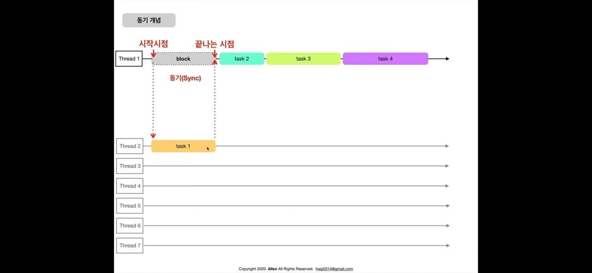
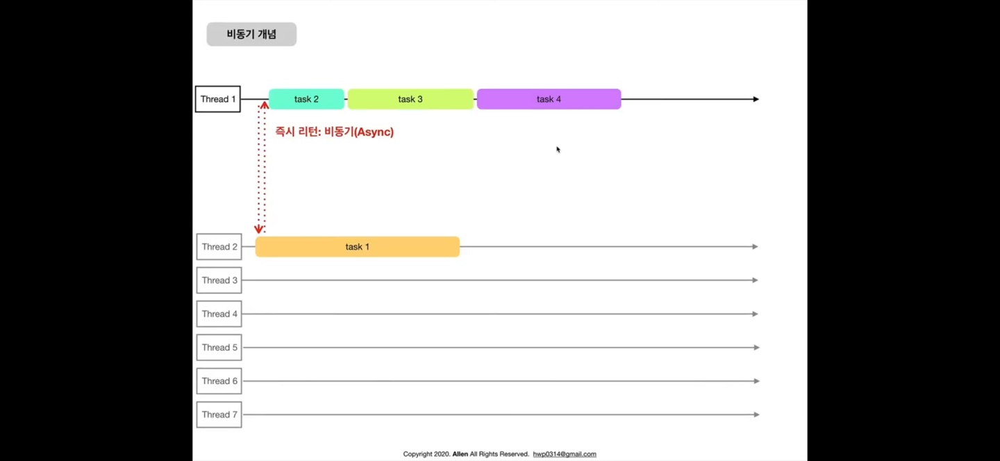

## 스레드(Thread)  
> 프로세스(프로그램) 내에서 실제로 작업을 수행하는 주체
- ex) 4코어 8쓰레드, 8코어 16쓰레드, 일을 하는 녀석(?)  
- 복사집을 차림 -> 복사기 여러대 삼 -> 한 대의 복사기만 계속 사용하는 상황 -> 일을 다른 복사기에도 분산시키고싶음(분산처리=동시적 처리)  

## 동기(Synchronous) 통신  
> 작업을 다른 쓰레드에서 하도록 시킨 후, 그 작업이 끝나길 <b>"기다렸다가"</b> 다음일을 진행한다.(기다렸다가 다음 작업을 생성할 수 있다.)
- ex) 어떤 함수를 호출했을 때 함수가 끝날 때까지 기다림. 함수값이 꼭 필요할 때, 순차적으로 진행해야할 때  

## 비동기(Asynchronous) 통신     
> 작업을 다른 쓰레드에서 하도록 시킨 후, 그 작업이 끝나길 <b> "안 기다리고" </b> 다음일을 진행한다.(안 기다려도 다음 작업을 생성할 수 있다.)

- ex) 어떤 함수를 호출했을 때 함수가 끝날 때까지 기다리지 않고 지나감. 함수의 수행여부와 상관없이 지나가도 괜찮을 때, callback() 함수로 호출된 함수의 결과값이 들어오게끔 해줌, 안드로이드에서의 통신도 비동기 통신임  
- 왜 필요할까? : 대부분은 서버와의 통신(네트워크 작업) 때문    

### 직렬(Seruak) 처리  
> (보통 메인에서) 분산처리 시킨 작업을 <b>"다른 한개의 쓰레드에서" </b> 처리
- 왜 직렬 처리가 필요할까? : 작업에 순서가 필요할 수도 있기 때문
- 순서가 중요한 작업을 처리할 때 사용  
### 동시(Cocurrent) 처리
> 몇개의 쓰레드로 분산할지는 시스템이 알아서 결정, 다만 <b>"여러개의 쓰레드에서"</b> 분산처리
- 각자 독립적이지만 유사한(중요도나 작업의 성격 등) 여러개의 작업을 처리할 때 사용  

## 왜 동시성 프로그래밍이 필요할까?  
- 성능/반응성  
- 최적화(앱)